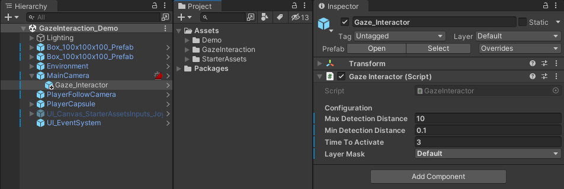
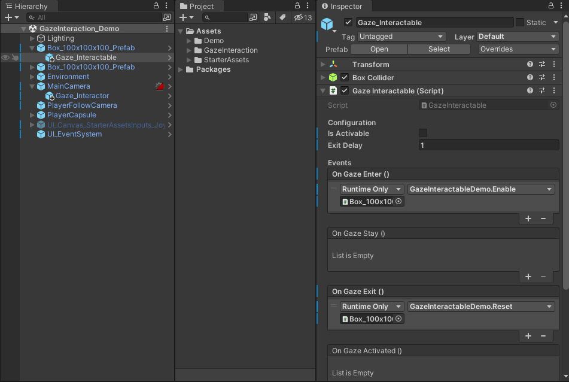

# Gaze Interaction System

I based my system on the same approach used in the [Unity XR Interaction Toolkit](https://docs.unity3d.com/Packages/com.unity.xr.interaction.toolkit@2.0/manual/index.html).

So, we have one [GazeInteractor](api/TS.GazeInteraction.GazeInteractor.html) that communicates with [GazeInteractables](api/TS.GazeInteraction.GazeInteractable.html) scattered through the environment.

The [GazeInteractor](api/TS.GazeInteraction.GazeInteractor.html) is a child of a Camera that sends raycasts looking for [GazeInteractables](api/TS.GazeInteraction.GazeInteractable.html). These in turn, when interacted with, invoke events that we can connect to other objects.

## Setup

1.  Add a [GazeInteractor](api/TS.GazeInteraction.GazeInteractor.html) as a child of the main Camera; 
    
2.  Add [GazeInteractables](api/TS.GazeInteraction.GazeInteractable.html) and connect the events to trigger the desired behaviours. 
    

The basic setup is quite simple. But, you have many options in each component to configure it even further.

If you want to include it in your own project, download the package from [GitHub](https://github.com/tomazsaraiva/unity-gaze-interaction/releases).

All feedback and contributions are more than welcome.